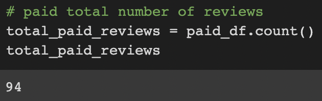
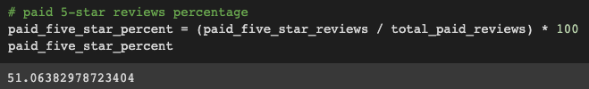

# Amazon_Vine_Analysis

## Overview

The Amazon Vine program is a service that allows manufacturers and publishers to receive reviews for their products. We have chosen a sample dataset from their Video Game reviews, and performed an ETL process to extract the dataset, transform the data, connect to an AWS RDS instance, and load the transformed data into pgAdmin. Next, we used PySpark to determine if there is any bias toward favorable reviews from Vine members.

**Resources**
- Data Source: [Amazon Review datasets](https://s3.amazonaws.com/amazon-reviews-pds/tsv/index.txt), [Video Games Review dataset](https://s3.amazonaws.com/amazon-reviews-pds/tsv/amazon_reviews_us_Video_Games_v1_00.tsv.gz)
- Software: Google Colab Notebook, PostgreSQL 11.9, pgAdmin 4, AWS*

## Results
### Number of Reviews:
Vine reviews:

Non-Vine reviews:

### Number of 5-Star Reviews:
Vine 5-Star reviews:

Non-Vine 5-Star reviews:

### Percentage of 5-Star reviews from the total
Percent of 5-Star Vine reviews:

Percent of 5-Star Non-Vine reviews:

## Summary

Because 51% of the reviews in the Vine program were 5-star reviews, while the percentage of 5-star reviews in the non-Vine programs is only 39%, it would be adequate enough evidence that there is a positivity bias for reviews within the Vine program. To further describe the positivity bias, it would be recommended that we compare the average, and most common review scores from both the Vine and Non-Vine programs.